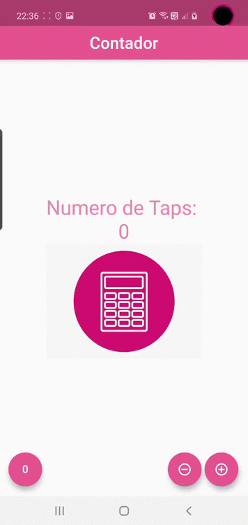

# Componentes

_Este es el primer proyecto que hice junto al curso de Flutter: Tu guia completa de desarrollo para iOS y Android, dictado por Fernando Herrera en Udemy._

_Contador_  

## Pruebas ⚙️

_Las pruebas fueron realizadas utilizando un dispositivo fisico (Samsung Galaxy S10) y un AVD emulando un Pixel 3XL_

## Construido con 🛠️

_Para este proyecto se utilizo Dart y Flutter. Como editor de codigo se utilizo el Visual Studio Code_

* [Flutter](https://flutter.dev/)
* [Dart](https://dart.dev/)
* [Visual Studio Code](https://code.visualstudio.com/)

## Autores ✒️

* **Karina Mastbaum** - *Codeo* - [KarinaMastbaum](https://github.com/KarinaMastbaum)
* **Fernando Herrera** - *Instructor del curso en Udemy* - [Klerith](https://github.com/Klerith)

---
Gracias por tu visita ❤️